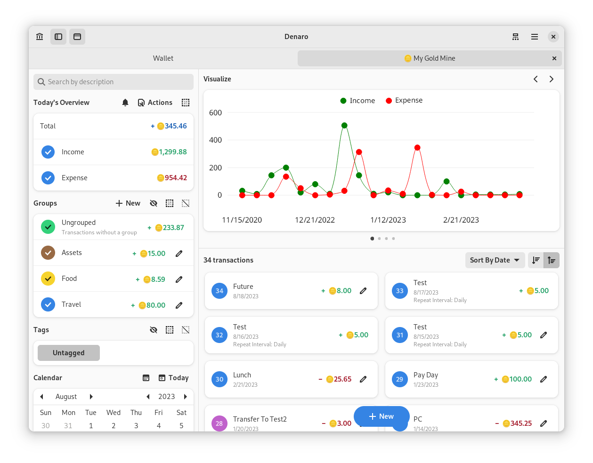
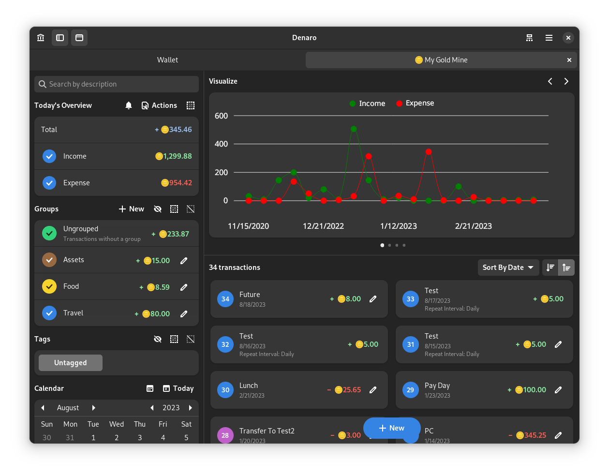
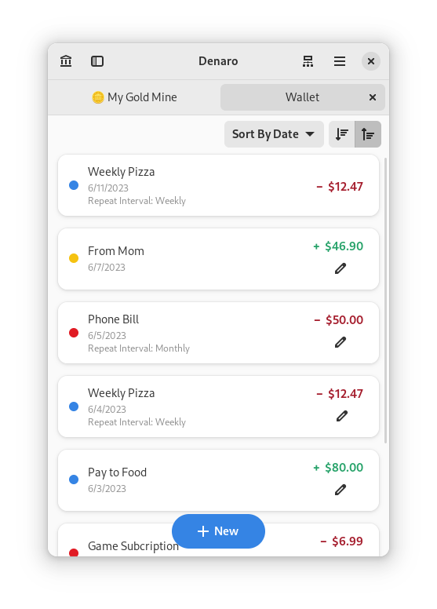
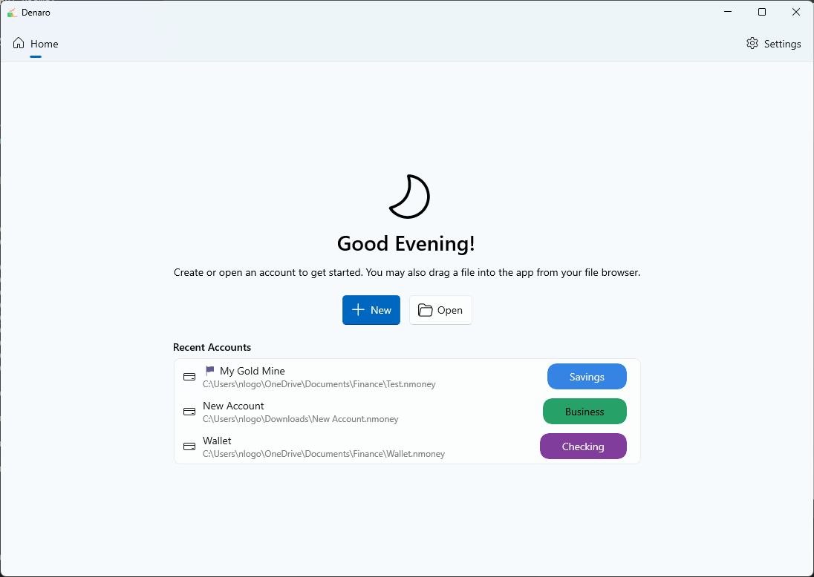
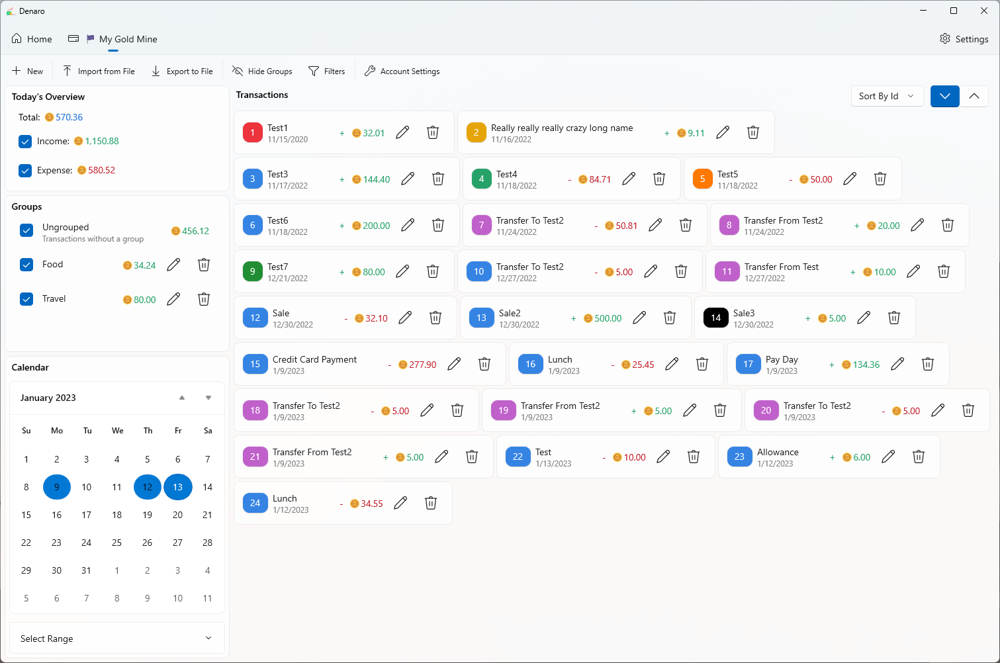
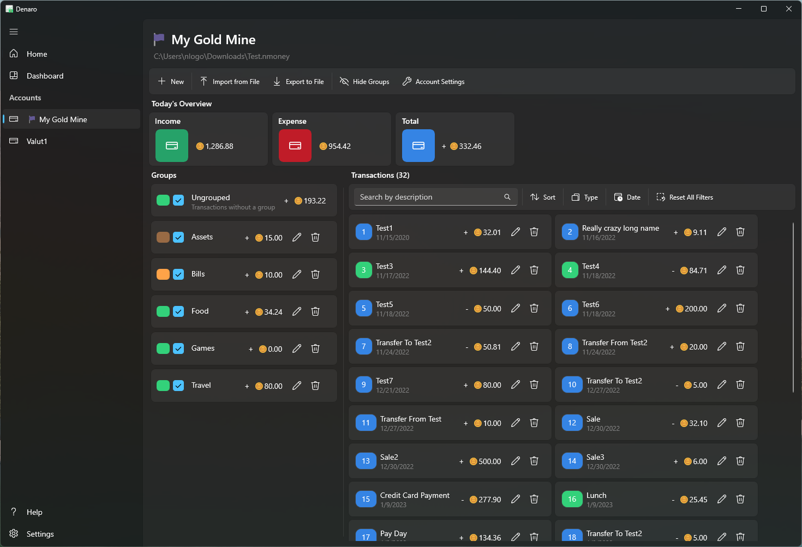
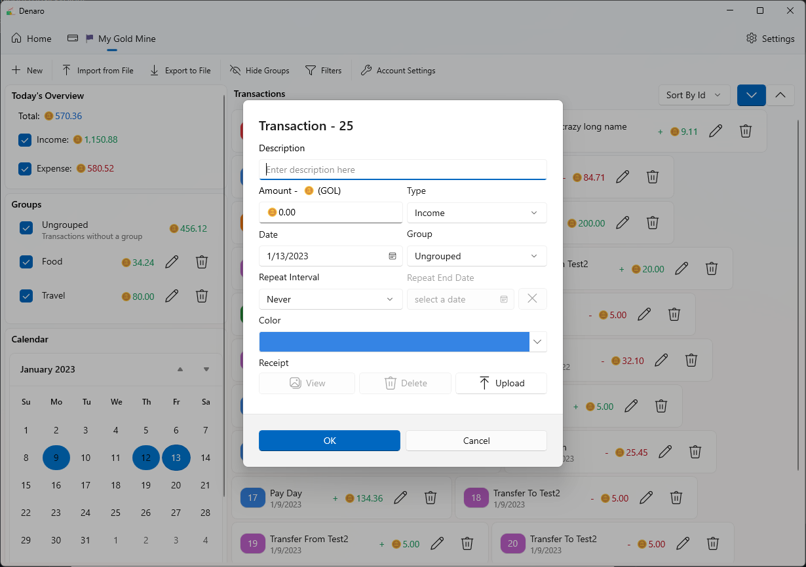

# Money


 **A personal finance manager**
 
 [](https://hosted.weblate.org/engage/nickvision-money/)

# Features
- A cross-platform C# application
  - Windows UI in Windows App SDK (WinUI 3)
  - GNOME UI in gir.core (Gtk4/Libadwaita)
- Manage multiple accounts at a time, with a familiar tab interface
- Easily filter transactions by type, group, or date
- Easily repeat transactions, such as bills that occur every month
- Transfer money from one account to another
- Export an account as a CSV file and import a CSV, OFX or QIF file to bulk add transactions to an account

# Installation

<a href='https://flathub.org/apps/details/org.nickvision.money'></a>

# Chat
<a href='https://matrix.to/#/#nickvision:matrix.org'></a>

# Translating
Everyone is welcome to translate this app into their native or known languages, so that the application is accessible to everyone.

## Via Weblate
Money is available to translate on [Weblate](https://hosted.weblate.org/engage/nickvision-money/)!

## Manually
To start translating the app, fork the repository and clone it locally.

In the `NickvisionMoney.Shared/Resources` folder you will see a file called `String.resx`. This is a C# resource file that contains all the strings for the application. Simply copy that file and rename it `String.<lang-code>.resx`. For example, if I'm creating an Italian translation, the copied file would be called `Strings.it.resx`. Once you have your copied file, simply replace each `<value>` block of each `<data>` string block with your language's appropriate translation.

To check your translation file, make sure your system is in the locale of the language you are translating and run the app. You should see your translated strings!

Once all changes to your translated file are made, make sure the file is in the path `NickvisionMoney.Shared/Resources/String.<lang-code>.resx`, commit these changes and create a pull request to the project.

# GNOME Screenshots


<p align='center'></p>

# WinUI Screenshots





# GNOME Theming

[](https://stopthemingmy.app) 

The Linux version of this app is designed for GNOME and optimized for the default Adwaita theme. If you customized your system look, it can negatively affect Money. However, in case of a breakage, we provide a way to customize some elements using CSS so you can make it look as you need. The CSS code should be added to `~/.config/gtk-4.0/gtk.css`. An example (not really pleasant-looking, it's just to show what modifications you can apply):

```
.denaro-total {
    background-color: @warning_color;
    color: #fff;
}

.denaro-income {
    color: @purple_2;
}

.denaro-expense {
    background: linear-gradient(to right, #000, @blue_4);
    color: #fff;
}

@define-color denaro_calendar_today_bg_color @blue_5;
@define-color denaro_calendar_today_fg_color #ff0000;
@define-color denaro_calendar_marked_day_fg_color @success_color;
@define-color denaro_calendar_selected_day_bg_color @card_bg_color;
@define-color denaro_calendar_selected_day_fg_color #55cc10;
@define-color denaro_calendar_other_month_fg_color @dark_5;
```

# Dependencies
- [.NET 7](https://dotnet.microsoft.com/en-us/)

# Special Thanks
- [daudix-UFO](https://github.com/daudix-UFO) for our application icons

# Code of Conduct
This project follows the [GNOME Code of Conduct](https://wiki.gnome.org/Foundation/CodeOfConduct).
