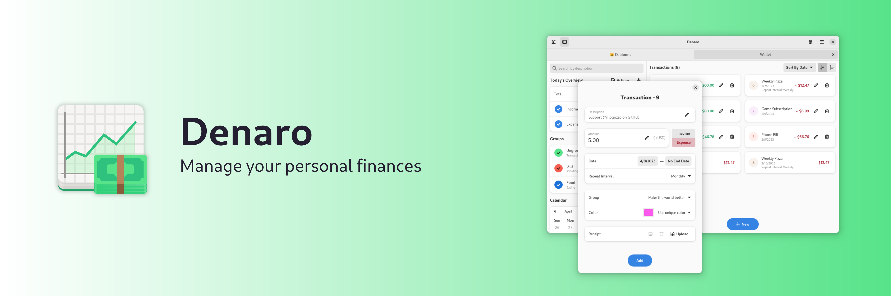
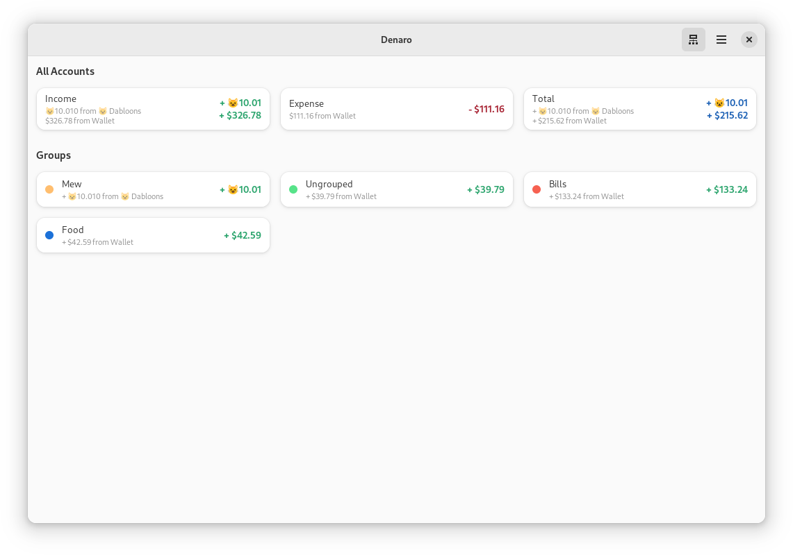
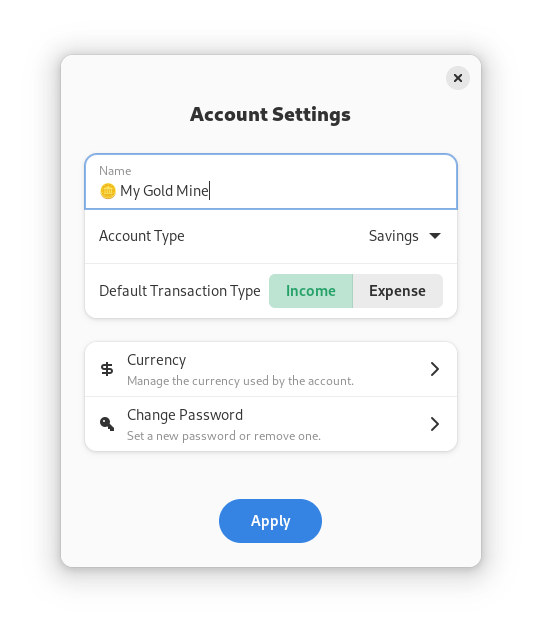
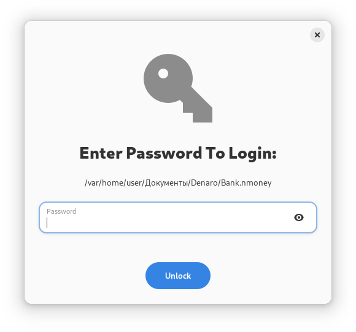

 
 [](https://hosted.weblate.org/engage/nickvision-money/) ✨Powered by [Weblate](https://weblate.org/en/)✨

# Features
- Manage multiple accounts at a time, with a familiar tab interface
- Easily filter transactions by type, group, or date
- Easily repeat transactions, such as bills that occur every month
- Transfer money from one account to another
- Export an account as a CSV file and import a CSV, OFX or QIF file to bulk add transactions to an account

# Installation

<a href='https://flathub.org/apps/details/org.nickvision.money'></a>

<a href="https://snapcraft.io/denaro"></a>

## What happened to Windows?
> Windows is no longer a supported platform by Nickvision due to many issues with publishing our apps on the Microsoft Store and many issues with Microsoft as a whole.

> Nickvision apps can still by used by Windows users via Flatpak on WSL (recommended distro: OpenSuse)

# Chat
<a href='https://matrix.to/#/#nickvision:matrix.org'></a>

# Contributing

See [CONTRIBUTING.md](CONTRIBUTING.md) for details on how can you help the project and how to provide information so we can help you in case of troubles with the app.

# Screenshots

<details>
 <summary>GNOME</summary>

 
 
 
 <p align='center'></p>
 <p align='center'></p>
</details>

<details>
 <summary>PDF Export Sample</summary>

 
 
 
</details>

# GNOME Theming

[](https://stopthemingmy.app) 

The Linux version of this app is designed for GNOME and optimized for the default Adwaita theme. If you customized your system look, it can negatively affect Denaro. However, in case of a breakage, we provide a way to customize some elements using CSS so you can make it look as you need. The CSS code should be added to `~/.config/gtk-4.0/gtk.css`. An example (not really pleasant-looking, it's just to show what modifications you can apply):

```
.denaro-total {
    background-color: @warning_color;
    color: #fff;
}

.denaro-income {
    color: @purple_2;
}

.denaro-expense {
    background: linear-gradient(to right, #000, @blue_4);
    color: #fff;
}

@define-color denaro_calendar_today_bg_color @blue_5;
@define-color denaro_calendar_today_fg_color #ff0000;
@define-color denaro_calendar_marked_day_fg_color @success_color;
@define-color denaro_calendar_selected_day_bg_color @card_bg_color;
@define-color denaro_calendar_selected_day_fg_color #55cc10;
@define-color denaro_calendar_other_month_fg_color @dark_5;
```

# Dependencies
- [.NET 7](https://dotnet.microsoft.com/en-us/)

# Code of Conduct
This project follows the [GNOME Code of Conduct](https://wiki.gnome.org/Foundation/CodeOfConduct).
