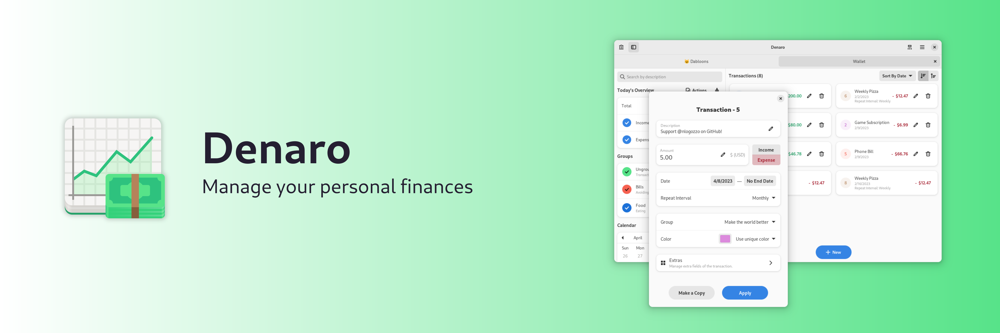

[](https://hosted.weblate.org/engage/nickvision-money/) ✨Powered by [Weblate](https://weblate.org/en/)✨

# Features
- Manage multiple accounts at a time, with a familiar tab interface
- Easily filter transactions by type, group, or date
- Easily repeat transactions, such as bills that occur every month
- Transfer money from one account to another
- Export an account as a CSV file and import a CSV, OFX or QIF file to bulk add transactions to an account

# Installation

<a href='https://flathub.org/apps/details/org.nickvision.money'></a>

<a href="https://snapcraft.io/denaro"></a>

<a href="https://aur.archlinux.org/packages/denaro"></a>

# Chat
<a href='https://matrix.to/#/#nickvision:matrix.org'></a>

# Building Manually
Denaro uses `vcpkg` to manage its dependencies and `cmake` as its build system.

Ensure both `vcpkg` and `cmake` are installed on your system before building.

A C++20 compiler is also required to build Denaro.

## Configuring vcpkg
1. Set the `VCPKG_ROOT` environment variable to the path of your vcpkg installation's root directory.
### Windows
1. Set the `VCPKG_DEFAULT_TRIPLET` environment variable to `x64-windows`
1. Run `vcpkg install boost-date-time libnick matplotplusplus podofo rapidcsv`
### Linux
1. Set the `VCPKG_DEFAULT_TRIPLET` environment variable to `x64-linux`
1. Run `vcpkg install boost-date-time libnick libxmlpp matplotplusplus podofo rapidcsv`

## Building
1. First, clone/download the repo.
1. Open a terminal and navigate to the repo's root directory.
1. Create a new `build` directory and `cd` into it. 
### Windows
1. From the `build` folder, run `cmake .. -G "Visual Studio 17 2022"`.
1. From the `build` folder, run `cmake --build . --config Release`.
1. After these commands complete, Denaro will be successfully built and its binaries can be found in the `org.nickvision.money.winui/Release` folder of the `build` folder.
### Linux
1. From the `build` folder, run `cmake .. -DCMAKE_BUILD_TYPE=Release`.
1. From the `build` folder, run `cmake --build .`.
1. After these commands complete, Denaro will be successfully built and its binaries can be found in the `org.nickvision.money.gnome` folder of the `build` folder.

# Contributing

See [CONTRIBUTING.md](CONTRIBUTING.md) for details on how can you help the project and how to provide information so we can help you in case of troubles with the app.

# Code of Conduct

This project follows the [GNOME Code of Conduct](https://wiki.gnome.org/Foundation/CodeOfConduct).

# GNOME Theming

[](https://stopthemingmy.app) 

The Linux version of this app is designed for GNOME and optimized for the default Adwaita theme. If you customized your system look, it can negatively affect Denaro. However, in case of a breakage, we provide a way to customize some elements using CSS so you can make it look as you need. The CSS code should be added to `~/.config/gtk-4.0/gtk.css`. An example (not really pleasant-looking, it's just to show what modifications you can apply):

```
.denaro-total {
    background-color: @warning_color;
    color: #fff;
}

.denaro-income {
    color: @purple_2;
}

.denaro-expense {
    background: linear-gradient(to right, #000, @blue_4);
    color: #fff;
}

@define-color denaro_calendar_today_bg_color @blue_5;
@define-color denaro_calendar_today_fg_color #ff0000;
@define-color denaro_calendar_marked_day_fg_color @success_color;
@define-color denaro_calendar_selected_day_bg_color @card_bg_color;
@define-color denaro_calendar_selected_day_fg_color #55cc10;
@define-color denaro_calendar_other_month_fg_color @dark_5;
```